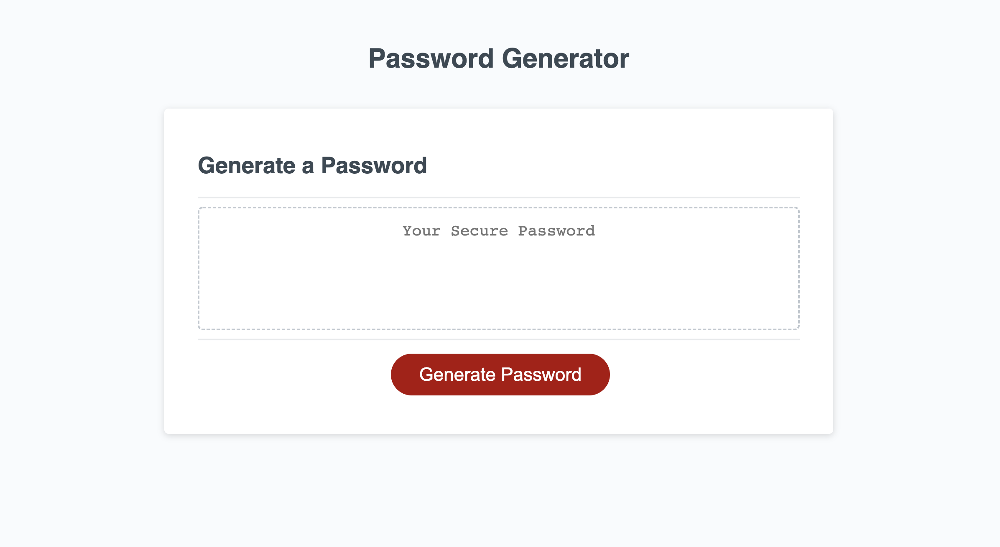
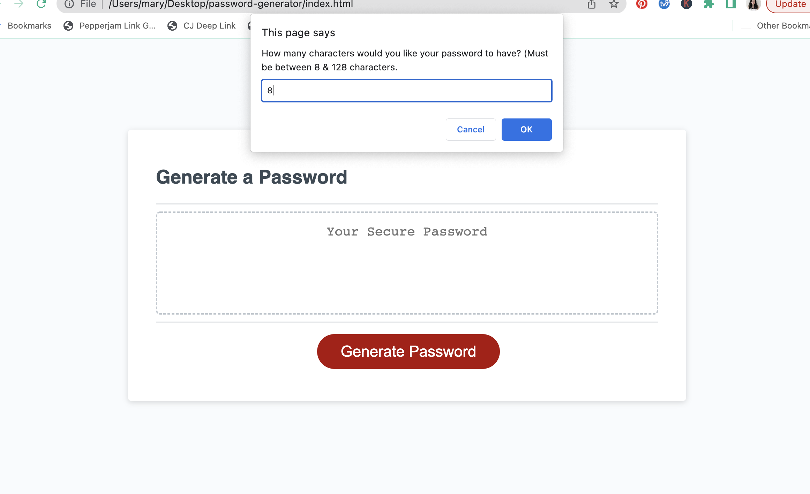
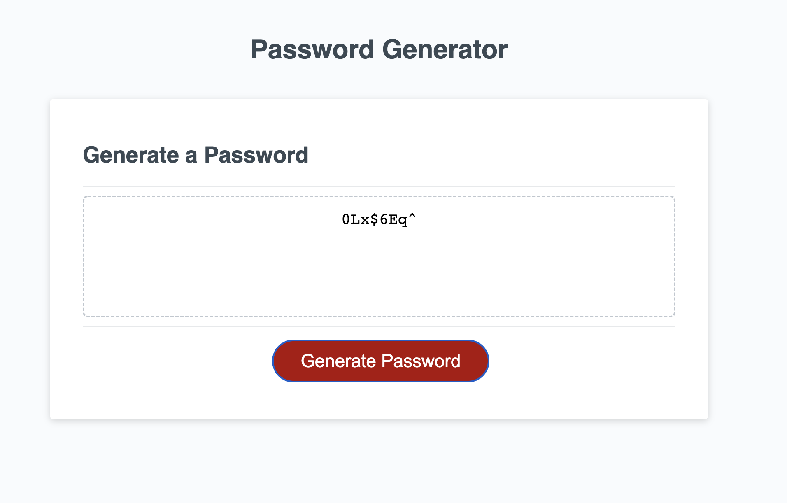

# password-generator

## Description

This code creates a password generator that generates a random string of characters of at least 8 and up to 128. The series of prompts will stop when a number outside of these parameters is given twice. 

It allows the user to select the number of characters they would like to have in their password. They are then allowed to choose, through confirms, whether or not they would like to include numbers, lowercase, uppercase, and/or special characters in their password.

Once they complete the set of prompts, a randomly generated password is given. 

https://mardill.github.io/password-generator/

## Installation

Access to running html, css, and javascript in a browser.

## Usage

To use this program, enter the amount of characters you would like your password to be (between 8 & 128 characters). 

Once the chosen amount is entered, the user will decide if they want numbers, lowercase, uppercase, and/or special characters through a pop-up. What they click will log as true or false.

This will then generate their password with the exact criteria they selected.

## License

MIT License

Copyright (c) 2022 mardill

Permission is hereby granted, free of charge, to any person obtaining a copy
of this software and associated documentation files (the "Software"), to deal
in the Software without restriction, including without limitation the rights
to use, copy, modify, merge, publish, distribute, sublicense, and/or sell
copies of the Software, and to permit persons to whom the Software is
furnished to do so, subject to the following conditions:

The above copyright notice and this permission notice shall be included in all
copies or substantial portions of the Software.

THE SOFTWARE IS PROVIDED "AS IS", WITHOUT WARRANTY OF ANY KIND, EXPRESS OR
IMPLIED, INCLUDING BUT NOT LIMITED TO THE WARRANTIES OF MERCHANTABILITY,
FITNESS FOR A PARTICULAR PURPOSE AND NONINFRINGEMENT. IN NO EVENT SHALL THE
AUTHORS OR COPYRIGHT HOLDERS BE LIABLE FOR ANY CLAIM, DAMAGES OR OTHER
LIABILITY, WHETHER IN AN ACTION OF CONTRACT, TORT OR OTHERWISE, ARISING FROM,
OUT OF OR IN CONNECTION WITH THE SOFTWARE OR THE USE OR OTHER DEALINGS IN THE
SOFTWARE.

